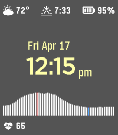

# Heartburn

A Zenburn-esque watchface with a heart rate graph for the Pebble Time 2. Written in Zig using [zig-pebble-sdk](https://github.com/vsergeev/zig-pebble-sdk).

Features:

* Weather conditions and temperature
* Upcoming sun event (sunrise or sunset)
* Battery charge
* Current heart rate
* Heart rate graph (~1 hr)
* Seconds on tap

# License

pebble-watchface-heartburn is MIT licensed. See the included [LICENSE](LICENSE) file.
